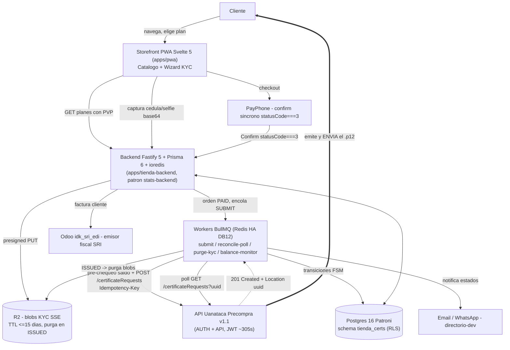

# Arquitectura — tienda.firmar.ec (tienda de certificados de firma electrónica)

## Resumen ejecutivo

`tienda.firmar.ec` es la tienda online de **certificados de firma electrónica `.p12`**, servicio complementario a `firmar.ec` (firmar.ec firma documentos; aquí se **venden** los certificados que habilitan esa firma). El proveedor/Autoridad de Certificación es **Uanataca Ecuador (Namirial)** bajo el modelo de distribuidor **"Precompra"**: la cuenta es de **GORINA & CONSULTORES** (stakeholder), que recarga saldo en **Uanacréditos** y cada emisión los descuenta. Nosotros operamos como **originadores comerciales**: catálogo + cobro al cliente final con margen + captura de KYC + originación de la solicitud + seguimiento de estado + notificación. **Restricción dura e inviolable: NUNCA custodiamos el `.p12`** — Uanataca lo emite y lo envía **directamente al correo del cliente**; nuestra plataforma solo detecta el estado `ISSUED` ("emitido/enviado"). Cero descarga, cero almacenamiento, cero custodia de material criptográfico. **Lo que NO construimos:** ningún endpoint que devuelva el `.p12`, ninguna lógica de firma fiscal paralela (Odoo es el único emisor SRI) y, en fase 1, ningún flujo de Token físico (solo Archivo `.p12`).

## Modelo de negocio y rol

- **Producto:** certificados de firma electrónica en contenedor **Archivo `.p12`** (Token físico diferido). Validez 1/2/3 años. Naturaleza: persona natural y, en fase posterior, Representante Legal (RL) / Miembro de Empresa (ME).
- **Cadena comercial:** Uanataca (AC, Namirial) → GORINA & CONSULTORES (cuenta distribuidor Precompra, dueña del saldo Uanacréditos) → nosotros (originador comercial) → cliente final.
- **Cómo se gana dinero:** PVP al cliente = **costo mayorista + margen**. El costo es dinámico (`GET /stakeholderProducts`). El descuento de Uanacréditos lo ejecuta Uanataca al crear la solicitud; nosotros cobramos por PayPhone al cliente. Son dos hechos contables distintos que se concilian.
- **Nuestro rol exacto:** (1) catálogo, (2) cobro con margen, (3) captura KYC, (4) originar la solicitud (`POST /certificateRequests`), (5) seguir el estado hasta terminal, (6) notificar al cliente.
- **NO custodiamos el `.p12` (regla rectora):** Uanataca emite y envía el certificado al correo del cliente. Nuestro lado solo recibe la confirmación (estado `ISSUED`) por polling. El modelo de datos **no tiene columna alguna para material criptográfico**.

## Arquitectura general

El frontend **nunca** habla con Uanataca ni ve el JWT de ~5 min ni las credenciales del distribuidor; todo lo privilegiado es server-side. El backend mintea el token Uanataca, sube los archivos KYC y hace polling de estado. El cliente solo conoce **estados de negocio** y el **PVP**.



**Flujo end-to-end en una línea:** cliente → storefront/KYC → pago PayPhone (confirm síncrono) → backend marca `PAID` → worker pre-chequea saldo y hace `POST /certificateRequests` (idempotente) → **Uanataca emite y envía el `.p12` al correo del cliente** → backend detecta `ISSUED` por polling → notifica al cliente y purga los blobs KYC.

**Decisión de stack (resuelve la contradicción Medusa vs ligero):** se adopta **storefront Svelte 5 (patrón `apps/pwa`) + backend propio `apps/tienda-backend` Fastify 5 + Prisma 6 + ioredis (patrón `stats-backend`), NO Medusa.** Justificación en una línea: el producto es catálogo pequeño + un cobro + originar/seguir-estado, sin inventario/peso/fulfillment físico, por lo que Medusa (regiones, inventario, fulfillment) sería código muerto (KISS/YAGNI, Art. 8). El cliente Uanataca vive en un **paquete del workspace** `packages/uanataca-client` (puro, sin DB/Redis), espejo de `@firma-ec/signare-client`; la persistencia, locks y colas viven en el backend.

---

## Integración Uanataca (cliente de la API Precompra v1.1)

Espejo directo del patrón `@firma-ec/signare-client` (interfaz abstracta + `FakeUanatacaClient` + `UanatacaHttpClient`). Reutiliza su forma de error, su `Page<T>` estilo Spring y su `idempotencyKey`. **El paquete solo habla con Uanataca** (puro); persistencia, locks y colas viven en `apps/tienda-backend`.

### Ubicación en el repo

```
firma-ec/
  packages/uanataca-client/          # paquete NUEVO (espejo de signare-client)
    package.json                     # "@firma-ec/uanataca-client", private, type:module, vitest
    src/
      types.ts          # DTOs del contrato Precompra v1.1
      client.ts         # interface UanatacaClient + class UanatacaError(message, status, body)
      token-manager.ts  # cache JWT 305s con margen + refresh on-demand (NO persiste)
      catalog.ts        # sync products + stakeholderProducts -> precio de costo, TTL 6h
      mapper.ts         # KYC capturado -> CreateCertificateRequestInput (PN / RL-ME / Archivo vs Token)
      idempotency.ts    # clave determinista por orden (hash) + helpers de lock
      status-poller.ts  # maquina NEW->ISSUED + cadencia/backoff + clasificacion de error
      http.ts           # UanatacaHttpClient implements UanatacaClient (fetch, 2 dominios)
      fake.ts           # FakeUanatacaClient (tests sin API real)
      index.ts          # barrel
    tests/ ...
  apps/tienda-backend/               # servicio Fastify que orquesta
    src/
      env.ts                         # zod schema: dominios + ruta de secretos
      plugins/uanataca.ts            # fastify-plugin que decora app.uanataca
      domain/order-state-machine.ts  # FSM pura + mapUanatacaToLocal() (sin I/O, testeable)
      services/cert-orders.ts        # crear orden, lock idempotente, enrolar poller
      workers/submit-request.ts      # POST idempotente PAID->SUBMITTED (BullMQ)
      workers/reconcile-uanataca.ts  # polling de estado (BullMQ)
      workers/purge-kyc-blobs.ts     # purga R2 al llegar a terminal
      jobs/balance-monitor.ts        # cron de saldo bajo
```

### Configuración de los dos dominios (auth vs api, test vs prod)

Un solo `entorno` selecciona los dos dominios. Las URLs públicas no son secreto, pero `username`/`password` SÍ → bóveda SOPS → Docker secret `*_FILE` → `process.env`.

```ts
// types.ts
export type UanatacaEnv = 'test' | 'prod';
export interface UanatacaDomains {
  authBaseUrl: string;  // {auth} — solo login
  apiBaseUrl: string;   // {api}  — products, balance, certificateRequests, ...
}
// Tabla de dominios del contrato v1.1 (resuelta por env, NO hardcodeada en negocio):
//  prod: auth=https://distribuidores.uanatacaec.com   api=https://distribuidores.uanataca.ec/api
//  test: auth=https://api-test.uanatacaec.com          api=https://distribuidores.test.uanataca.appshandler.com
export const UANATACA_DOMAINS: Record<UanatacaEnv, UanatacaDomains> = { /* ... */ };
```

```ts
// apps/tienda-backend/src/env.ts  (extiende el zod schema)
UANATACA_ENV: z.enum(['test', 'prod']).default('test'),
UANATACA_USERNAME: z.string().min(1),          // <- Docker secret _FILE
UANATACA_PASSWORD: z.string().min(1),          // <- Docker secret _FILE
UANATACA_STAKEHOLDER_UUID: z.string().uuid(),  // cuenta GORINA (config, no codigo)
UANATACA_BALANCE_LOW_THRESHOLD: z.coerce.number().default(50), // Uanacreditos
```

Secretos en SOPS bajo `apps_tienda_firmar_ec.uanataca.{username,password,stakeholder_uuid,env}` (más `apps_tienda_firmar_ec.uanataca.portal.*` para el login self-service humano del portal de saldo).

### Token JWT (~305 s) — cache con margen, refresh, NO persistir

`POST {auth}/piccolos/auth/login` → `{ access_token, token_type:"Bearer", expires_in:305 }`. El JWT **nunca** toca disco/DB/Redis: vive en memoria del proceso, se refresca con **margen de 30 s** y un mutex que evita el thundering-herd de logins.

```ts
// token-manager.ts (esencial)
export class UanatacaTokenManager {
  private cached?: { token: string; expiresAtMs: number };
  private inFlight?: Promise<string>;
  private static readonly SAFETY_MARGIN_MS = 30_000;
  async getToken(): Promise<string> {
    const now = Date.now();
    if (this.cached && this.cached.expiresAtMs - UanatacaTokenManager.SAFETY_MARGIN_MS > now) return this.cached.token;
    if (!this.inFlight) this.inFlight = this.login().finally(() => { this.inFlight = undefined; });
    return this.inFlight; // las llamadas concurrentes esperan el MISMO login
  }
  invalidate(): void { this.cached = undefined; } // lo llama el http client ante 401, una sola vez
  private async login(): Promise<string> {
    const res = await this.f(`${this.authBaseUrl}/piccolos/auth/login`, {
      method: 'POST', headers: { 'content-type': 'application/json', accept: 'application/json' },
      body: JSON.stringify(this.creds),
    });
    if (!res.ok) throw new UanatacaError(`auth login ${res.status}`, res.status, await res.text().catch(() => ''));
    const j = (await res.json()) as { access_token: string; expires_in: number };
    this.cached = { token: j.access_token, expiresAtMs: Date.now() + j.expires_in * 1000 };
    return this.cached.token;
  }
}
```

El `UanatacaHttpClient` inyecta `Authorization: Bearer <token>` en cada request a `{api}`. Ante `401` de negocio: `invalidate()` + **un solo** re-login + 1 reintento (no bucle).

### Catálogo: products + stakeholderProducts → precio de costo

`GET {api}/products` (catálogo global) × `GET {api}/stakeholderProducts/{uuid}` (precios de COSTO) cambian poco → **TTL 6 h** en Redis (DB 12), refresco bajo demanda. El `containerUuid` distingue **Archivo `.p12`** vs **Token físico** (derivado del catálogo de containers, **no por nombre**).

```ts
// catalog.ts
export interface ResolvedProduct {
  productUuid: string; code: string; name: string;
  listPrice: number;        // products[].price (referencia)
  costPrice: number;        // stakeholderProducts[].price  <- descuenta Uanacreditos
  containerUuid: string; isPhysicalToken: boolean; active: boolean;
}
export interface UanatacaCatalog {
  list(): Promise<ResolvedProduct[]>;
  refresh(): Promise<ResolvedProduct[]>; // TTL 6h
}
```

Refresco: (a) al arranque del worker, (b) cron cada 6 h (BullMQ repeatable), (c) endpoint admin `POST /admin/uanataca/catalog/refresh`.

### Saldo Precompra + alerta de saldo bajo

`GET {api}/uanacredits/balance` → decimal. Worker `balance-monitor` (cron, BullMQ) compara contra `UANATACA_BALANCE_LOW_THRESHOLD`; si `balance < threshold` → alerta vía `directorio-dev` (WhatsApp/correo) + registro en auditoría. Además **chequeo pre-emisión**: `cert-orders` consulta saldo antes de cada `POST /certificateRequests`; si el costo supera el saldo → falla limpio `insufficient_balance` (fail-closed, no se intenta el POST). Se mantiene un contador propio `precompra_reserved_usd` (suma de jobs originados aún no liquidados) para trabajar sobre `balance_disponible = balance_uanataca − precompra_reserved_usd` y no sobre-vender por concurrencia.

### Creación de solicitud (KYC capturado → payload)

`mapper.ts` traduce el KYC capturado al `CreateCertificateRequestInput`, ramificando por **naturaleza** (PN vs RL/ME) y **tipo de producto** (Archivo vs Token, vía `containerUuid`). Valida **antes** de tocar la red (fail-closed): `fingerprintCode` req. si `CÉDULA`; `rucFile` si `RUC`; `tokenInfo` solo si `isPhysicalToken`; `constitution`/`appointment` si RL/ME; imágenes validadas por magic bytes + tamaño.

```ts
// types.ts
export type IdentificationType = 'CÉDULA' | 'PASAPORTE' | 'RUC';
export type Sex = 'HOMBRE' | 'MUJER';
export interface CertFile { name: string; type: string; base64: string; }
export interface CreateCertificateRequestInput {
  identificationType: IdentificationType; identification: string; fingerprintCode?: string; // req si CÉDULA
  names: string; lastName1: string; lastName2?: string;
  birthDate: string; // dd/MM/yyyy (lo formatea el mapper)
  nationality: string; sex: Sex;
  phoneNumber: string; phoneNumber2?: string; email: string; email2?: string;
  province: string; city: string; address: string;
  productUuid: string; offerUuid?: string;
  // RL / ME
  ruc?: string; company?: string; department?: string; position?: string; reason?: string;
  identificationTypeManager?: string; identificationManager?: string; namesManager?: string; lastNameManager?: string;
  // Token fisico (solo si isPhysicalToken)
  tokenInfo?: { shippingTypeUuid: string; deliveryMethod: 'PICKUP' | 'DELIVERY'; office?: string;
                address?: string; contactName: string; contactPhone: string; };
  // Archivos base64 (REQ: frontIdentification, backIdentification, selfie)
  files: {
    frontIdentification: CertFile; backIdentification: CertFile; selfie: CertFile;
    seniorVideo?: CertFile; rucFile?: CertFile;                    // rucFile req si RUC
    constitution?: CertFile; appointment?: CertFile; acceptanceAppointment?: CertFile; // RL/ME
    authorization?: CertFile; managerIdentification?: CertFile;    // apoderado / RL-ME
    additionalFile?: CertFile;
  };
  idempotencyKey: string; // local (NO la consume Uanataca; gobierna el lock)
}
```

```ts
// client.ts
createCertificateRequest(input: CreateCertificateRequestInput): Promise<CreateCertificateRequestResult>;
// POST {api}/certificateRequests -> 201 + header Location (uri del recurso). body vacio.
// El cliente PARSEA el Location para extraer el uuid de la solicitud creada.
```

### Reintentos, backoff y clasificación de errores

`UanatacaError(message, status, body)` (mismo shape que `SignareError`):

| Status | Significado | ¿Recuperable? | Acción |
|---|---|---|---|
| 400 | Faltan campos / reglas | **No** | Fallar limpio, detalle saneado al UI (sin PII), orden `FAILED:validation`. No reintentar. |
| 401 | Token vencido/inválido | Sí (acotado) | `invalidate()` + **1** re-login + 1 reintento. Si persiste → `FAILED:auth` + alerta. |
| 403 | Rol/permiso insuficiente | **No** | Fallar; problema de cuenta/rol (SH_ADMIN/SH_OPERATOR). Alerta a operación. |
| 500 | Error servidor Uanataca | **Sí** | Backoff exponencial con jitter (1s, 2s, 4s, 8s; máx 4 intentos). |
| timeout/red | — | **Sí** | Igual que 500. |

**Regla dura del POST de creación:** nunca se reintenta a ciegas un 500/timeout; primero pasa por la **reconciliación** de idempotencia (un 500 puede haber cobrado igual). El backoff vive en el worker BullMQ (`attempts` + `backoff:{type:'exponential'}`), no en `sleep` arbitrarios.

### Manejo honesto de fallos

Todo error de red/HTTP se propaga como `UanatacaError` con `status` + `body` saneado; jamás `catch {}` vacío. El `FakeUanatacaClient` permite QA e2e completo (login→catálogo→balance→create→poll→ISSUED) sin API real ni consumir Uanacréditos. Auditoría hash-chain registra cada `createCertificateRequest` y cada transición con `who/when/orderId/uuid/status`. Cero PII en logs/respuestas.

```ts
export interface UanatacaClient {
  listProducts(): Promise<Product[]>;
  listStakeholderProducts(stakeholderUuid: string): Promise<StakeholderProduct[]>;
  getBalance(): Promise<number>;
  createCertificateRequest(input: CreateCertificateRequestInput): Promise<CreateCertificateRequestResult>;
  listCertificateRequests(q?: string, status?: string, uuid?: string): Promise<CertificateRequest[]>;
  getCertificateRequest(uuid: string): Promise<CertificateRequest>;
}
export class UanatacaError extends Error { constructor(message: string, readonly status?: number, readonly body?: unknown) {/*...*/} }
```

Plugin Fastify (`plugins/uanataca.ts`, vía `fastify-plugin`) decora `app.uanataca: UanatacaClient` con override inyectable (`FakeUanatacaClient`) para tests — mismo patrón que `app.audit` / `app.redis`.

**Archivos a espejar (rutas absolutas):**
- Interfaz/error: `c:/Users/alfon/Nextcloud/Documentos/Claude.md/firma-ec/packages/signare-client/src/client.ts`
- DTOs + `idempotencyKey`: `c:/Users/alfon/Nextcloud/Documentos/Claude.md/firma-ec/packages/signare-client/src/types.ts`
- HTTP adapter + auth provider inyectable: `c:/Users/alfon/Nextcloud/Documentos/Claude.md/firma-ec/packages/signare-client/src/http.ts`
- Env (zod + Docker secrets `*_FILE`): `c:/Users/alfon/Nextcloud/Documentos/Claude.md/firma-ec/apps/inbox-backend/src/env.ts`
- Error→HTTP por código: `c:/Users/alfon/Nextcloud/Documentos/Claude.md/firma-ec/apps/inbox-backend/src/lib/errors.ts`
- Plugin (decorate + override test): `c:/Users/alfon/Nextcloud/Documentos/Claude.md/firma-ec/apps/inbox-backend/src/plugins/{redis,audit}.ts`
- Fórmula de margen a reutilizar literalmente: `c:/Dev/fec-deploy/packages/signare-client/src/pricing-calc.ts` (`netMargin`/`pvpForProfit`).

---

## Storefront + flujo de captura KYC (UX de pocos pasos)

El storefront **vive dentro de la PWA Svelte ya desplegada** (`apps/pwa`, Svelte 5 + Vite 6 + UnoCSS `presetWind4`, `svelte-spa-router`), no en un app nuevo ni en Astro. El flujo de compra ya existe vivo en `apps/pwa/src/routes/ComprarCertificado.svelte` (wizard de 5 pasos) con `Certificados.svelte` y `apps/pwa/src/lib/certsApi.ts`; re-implementarlo en Astro duplicaría y rompería Art. 8. La captura usa el patrón nativo `<input type="file" accept="image/*" capture="user|environment">` + `fileToB64()` (sin WebRTC/canvas: el canvas de `recepcion-express` era para firma manuscrita). Tokens (`ink/brand/ok/warn/err` oklch), `font-display`=Geist, iconos `i-lucide-*`, `prefers-reduced-motion` y dark mode `[data-theme]` se reutilizan. **Astro (`apps/landing`) queda solo para la landing de marketing** (hero + "desde $X" + CTA → `app.firmar.ec/#/certificados`).

**Lo que cambia vs lo vivo:** el código actual está modelado contra Signare/ArgosData (persona natural fija, 3 fotos). Se adapta `certsApi.ts` + wizard al contrato Uanataca: tipos de persona (natural Archivo / RL / ME), documentos condicionales y estados `NEW→…→ISSUED/REJECTED/CANCELED`.

### Catálogo (pantalla `Certificados.svelte`, ampliada)

Selector de tipo de persona arriba, planes debajo (progressive disclosure). Smart default: **Persona natural · Archivo (.p12) · 1 año**.

```
[ Hero corto + 3 bullets de confianza ]
[ Segmented control — ¿Para quién es?  (default: Persona natural) ]
   ( ) Persona natural   ( ) Representante legal   ( ) Miembro de empresa
[ Lista de planes según tipo — tarjetas seleccionables ]
   Archivo .p12 · 1 año    — $XX    [v]
   Archivo .p12 · 2 años   — $XX
   Archivo .p12 · 3 años   — $XX
[ CTA fija inferior:  Empezar -> ]
```

```ts
// apps/pwa/src/lib/certsApi.ts  (ampliacion del CertPlan existente)
export type PersonType = 'natural' | 'legalRep' | 'companyMember';
export type ContainerKind = 'archivo' | 'token';
export interface CertPlan {
  uuid: string;            // productUuid de Uanataca (no exponer el costo)
  titulo: string; personType: PersonType; container: ContainerKind;
  periodo: 'YEARS'; duracion: 1 | 2 | 3;
  pvp: string;             // PRECIO DE VENTA (costo+margen), calculado en backend
  moneda: 'USD';
}
```

El **PVP = costo + margen** lo calcula el **backend** con `pricing-calc.ts` (`netMargin`/`pvpForProfit`, fórmula `venta×0.81207 − costo/1.15` que cubre PayPhone 5.75% + IVA). El front recibe `pvp` resuelto y nunca ve el costo del stakeholder. **Token físico se oculta del storefront en fase 1** (requiere `shippingTypeUuid`/dirección; YAGNI).

### Wizard de compra (extiende `ComprarCertificado.svelte`)

Esqueleto vivo (un foco por pantalla, CTA fija inferior, barra de progreso, `fly` 220 ms con `prefers-reduced-motion`, scroll-to-top). Los pasos se vuelven dinámicos según `personType` (`STEPS` pasa a `$derived`).

| # | Paso | Natural | RL | ME |
|---|------|:------:|:--:|:--:|
| 1 | **Plan** (confirma vigencia) | ✓ | ✓ | ✓ |
| 2 | **Identidad** (cédula + código dactilar) | ✓ | ✓ | ✓ |
| 3 | **Tus datos** (nombres, ubicación, contacto, correo) | ✓ | ✓ | ✓ |
| 4 | **Datos de empresa** (RUC, razón social, cargo, motivo, depto) | — | ✓ | ✓ |
| 5 | **Fotos / documentos** | 3 | 6 | 5 |
| 6 | **Revisar y pagar** (resumen + consentimiento LOPDP + PayPhone) | ✓ | ✓ | ✓ |

Natural = 5 pasos (sin "Datos de empresa"); RL/ME = 6.

**Campos por paso** (mapeo directo al body de `POST {api}/certificateRequests`):
- **Paso 2 — Identidad:** `identification` (cédula, módulo-10 ecuatoriano), `fingerprintCode` (req. si CÉDULA; `^[A-Z0-9]{6,10}$`, `autocapitalize="characters"`). `identificationType` default `CÉDULA`; PASAPORTE bajo "¿Usas pasaporte?" (quita dactilar, libera reverso).
- **Paso 3 — Tus datos:** `names`, `lastName1`, `lastName2?`, `birthDate` (dd/MM/yyyy), `nationality` (default `Ecuador`), `sex`, `phoneNumber` (`^[0-9]{10}$`), `province`/`city` (selects de catálogo), `address`, `email` (+`email2?` colapsado). `phoneExtension` default `593`.
- **Paso 4 — Empresa (RL/ME):** `ruc` (`^[0-9]{10}001$`), `company`, `position`, `reason`, `department` (solo ME). Si el firmante no es el RL (apoderado): bloque colapsable `identificationManager`, `namesManager`, `lastNameManager`.
- **Paso 5 — Fotos/documentos:** tiles `photoTile`. Cédula frontal (`capture="environment"`) + reverso (`environment`) + selfie (`capture="user"`). Empresa añade `rucFile`; RL/ME añaden `constitution`/`appointment` (PDF). Cada archivo → `fileToB64()` → `{name,type,base64}`.
- **Paso 6 — Pagar:** resumen (Plan, identificación, Total = `pvp`) + checkbox de consentimiento (`acceptedWill`+`acceptedContract`) con nota LOPDP. CTA → `checkout()` → redirige a PayPhone (`window.location.href = res.urlPago`).

**Effortless-flow (medible):** Tesler (el cliente nunca elige UUIDs/`containerUuid`; manda `personType`+`duracion`, el backend resuelve `productUuid`, precio e idempotencia) · smart defaults (Persona natural · 1 año · `nationality=Ecuador` · `phoneExtension=593` · `CÉDULA`) · progressive disclosure (PASAPORTE, segundo correo, apoderado, empresa solo si aplican) · autosave del `$state` en `localStorage` (`tienda:draft:v1`, limpiar al `ISSUED`/`CANCELED`) · criterio observable: time-on-task < 4 min para natural + tasa de completado instrumentada por paso.

### Validaciones cliente (gating barato antes del POST)

Centralizadas en `apps/pwa/src/lib/kycValidators.ts` (nuevo, puro, con tests Vitest). El cliente gatea; la AC es la autoridad final.
- **Cédula:** `^[0-9]{10}$` endurecido con dígito verificador módulo-10 (provincia 01–24 + 30). Mensaje llano.
- **RUC:** `^[0-9]{13}$`, 10 primeros = cédula/sociedad/público válido, termina en `001`; empresa `^[0-9]{10}001$`.
- **Código dactilar:** `^[A-Z0-9]{6,10}$`, normalizar a mayúsculas.
- **Imágenes:** magic bytes (JPEG `FF D8 FF`, PNG `89 50 4E 47`, PDF `25 50 44 46`) + tamaño **≤ 5 MB** + dimensión mínima sugerida (avisar, no bloquear, si <640px).
- **Teléfono/correo:** `^[0-9]{10}$` y `includes('@')`.
- **Selfie:** aviso de luminancia baja (warning no bloqueante). Liveness real **no** en el front (es de la AC).

`stepValid` (`$derived`) se amplía con estos validadores, deshabilitando "Siguiente" hasta cumplir.

### Estados visibles para el cliente (`MisCertificados.svelte`, nueva)

Pantalla de seguimiento (`/#/certificados/estado/:orderId`), alimentada por **polling al backend** (el front nunca llama a Uanataca). El front hace polling suave: `setInterval` 15 s mientras la pestaña es visible (`visibilitychange`), backoff a 60 s tras 5 min, parar en terminales.

| Uanataca | Estado cliente (UI) | Icono / color | Copy |
|---|---|---|---|
| `NEW` | **Recibida** | `i-lucide-inbox` / brand | "Recibimos tu solicitud, la estamos enviando a la entidad certificadora." |
| `IN_VALIDATION` | **En validación** | `i-lucide-loader` / brand | "La entidad está revisando tus datos. Suele tardar poco." |
| `UPDATE_REQUESTED` | **Necesita corrección** | `i-lucide-alert-triangle` / warn | "Hay que corregir algo. Toca para ver qué." + botón **Corregir** |
| `UPDATED` | **Corrección enviada** | `i-lucide-check` / brand | "Enviamos tu corrección. En revisión otra vez." |
| `ISSUED` | **¡Emitido!** | `i-lucide-mail-check` / ok | "Tu certificado fue enviado a tu correo por la entidad certificadora. Revisa tu bandeja (y spam)." |
| `REJECTED` | **Rechazada** | `i-lucide-x-circle` / err | "La solicitud no pasó. Motivo: {comments}. Puedes intentar de nuevo." |
| `CANCELED` | **Cancelada** | `i-lucide-ban` / ink | "Esta solicitud fue cancelada." |

Diseño: **timeline vertical** (Recibida → Validación → Emitido) + tarjeta de estado actual grande, reflejando `requestDate`/`approvedDate`. **`ISSUED` deja claro que el `.p12` lo manda Uanataca al correo, no nosotros** (refuerza cero-custodia). Componente nuevo `src/ui/firma/StatusTimeline.svelte`.

### Flujo de corrección — `UPDATE_REQUESTED`

No rehacer todo el wizard, solo lo señalado. El backend traduce `comments` de Uanataca a `fieldsToFix: ('selfie'|'cedulaFront'|'ruc'|'address'|...)[]` + mensaje humano. Pantalla `CorregirSolicitud.svelte` (`/#/certificados/corregir/:orderId`): muestra **solo** los campos/tiles afectados, pre-rellenados. CTA **Reenviar corrección** → backend reenvía a Uanataca → estado `UPDATED`. Deep-link tokenizado (HMAC, patrón `?t=exp.sig` de `recepcion-express`) para llegar directo desde el correo sin re-login. Idempotente (no duplica solicitud).

### Rutas, archivos y contrato front↔backend

```
src/routes/Certificados.svelte          (AMPLIAR: + segmented control personType)
src/routes/ComprarCertificado.svelte    (AMPLIAR: STEPS dinamicos por personType + paso empresa + reverso cedula)
src/routes/MisCertificados.svelte        (NUEVO: timeline de estado + polling)
src/routes/CorregirSolicitud.svelte      (NUEVO: mini-wizard UPDATE_REQUESTED)
src/lib/certsApi.ts                      (AMPLIAR: PersonType, ContainerKind, estados, fetchEstado(), reenviarCorreccion())
src/lib/kycValidators.ts                 (NUEVO: cedula modulo-10, RUC, dactilar, magic bytes — con Vitest)
src/ui/firma/StatusTimeline.svelte       (NUEVO: timeline de estados, tokens ok/warn/err)
```

**Contrato front↔backend (el front nunca toca Uanataca):**
- `GET /api/certificados/planes?personType=natural|legalRep|companyMember` → `CertPlan[]` (pvp ya con margen).
- `POST /api/certificados/checkout` → `{ orderId, urlPago, pvp }` (backend hace el POST a Uanataca + sube archivos + idempotencyKey).
- `GET /api/certificados/estado/:orderId` → `{ estadoNegocio, uanatacaStatus, fieldsToFix?, comments?, requestDate, approvedDate? }`.
- `POST /api/certificados/:orderId/correccion` → reenvía la corrección (UPDATED).

---

## Modelo de datos y máquina de estados

Backend liviano patrón `stats-backend` (Fastify 5 + Prisma 6 + ioredis), Postgres 16 Patroni (`postgres16_postgres:5432`, líder directo para migraciones), Redis HA (`redis-ha:6379` **DB 12** — 8/9/10/11 ocupados), secretos `*_FILE` → `process.env`. PayPhone confirm síncrono (no webhook server-side). Uanataca sin webhook → confirmación por polling. **El modelo NO tiene columna alguna para material criptográfico.**

### Principios

1. **Cero PII más de lo necesario, cero `.p12`.** KYC mínimo (lo que exige `POST /certificateRequests`) en schema aislado con RLS; los blobs base64 NO se persisten en Postgres, van a R2 con auto-purga (solo guardamos *key* + hash). Tras `ISSUED`, se purgan.
2. **El estado Uanataca es la verdad del lado AC; el estado local es la verdad comercial.** Se mapean y reconcilian por polling.
3. **Cobro al cliente y descuento de Uanacréditos son hechos distintos.** Nunca se crea la solicitud antes de tener el pago confirmado (fail-closed contra doble emisión / consumo sin cobro).
4. **Idempotencia en los dos bordes peligrosos:** confirmación de pago y creación de solicitud.

### Entidades (schema `tienda_certs`)

| Entidad | Rol | Notas |
|---|---|---|
| `customer` | Cliente/solicitante + PII KYC | aislado por RLS; PII mínima |
| `cert_order` | Orden comercial (carrito→checkout→pago) | dueña del cobro; 1 línea = 1 certificado (KISS) |
| `payment` | Intento/resultado PayPhone | confirm síncrono idempotente |
| `certificate_request` | Solicitud local espejo del recurso Uanataca | `uuid` remoto + status remoto + status local |
| `balance_movement` | Movimiento de Uanacréditos | conciliación costo descontado vs saldo |
| `request_status_event` | Auditoría inmutable de transiciones | append-only, hash-chain por orden |
| `notification` | Notificación al cliente por transición | email/WhatsApp, idempotente por `(request_id, event, channel)` |

### Mapeo estado local ↔ estado Uanataca

| Estado local | uanataca_status | Significado |
|---|---|---|
| `DRAFT` | — | Carrito / producto elegido, sin KYC completo |
| `KYC_PENDING` | — | Falta capturar/validar cédula/selfie/RUC |
| `PAYMENT_PENDING` | — | KYC OK; esperando confirmación PayPhone |
| `PAID` | — | Pago confirmado (`statusCode===3`); aún NO enviado a Uanataca |
| `SUBMITTING` | (POST en curso) | Llamando `POST /certificateRequests` (sección crítica idempotente) |
| `SUBMITTED` | `NEW` | Solicitud creada (tenemos `uuid` + `Location`) |
| `IN_REVIEW` | `IN_VALIDATION` | Uanataca validando; nada que hacer |
| `CORRECTION_REQUESTED` | `UPDATE_REQUESTED` | Pedir corrección al cliente |
| `CORRECTION_SUBMITTED` | `UPDATED` | Cliente corrigió; re-enviado a validación |
| `REJECTED` | `REJECTED` | Rechazado por la AC → política de reembolso |
| `ISSUED` | `ISSUED` | Emitido y **enviado por Uanataca al correo del cliente** |
| `CANCELED` | `CANCELED` | Cancelado (cliente antes de emitir, o AC) |
| `REFUNDED` | — (terminal local) | Reembolso ejecutado tras `REJECTED`/`CANCELED` pagado |
| `FAILED` | — | Error nuestro irrecuperable (pago OK pero `POST` falló N veces) → escalar; NO consume saldo |

**Reconciliación (poll):** worker BullMQ `GET /certificateRequests?uuid={uuid}` con backoff (30 s→2 m→5 m mientras `IN_REVIEW`), lee `uanataca.status`, aplica la transición local. El `uanatacaStatus` adicional se guarda como `certificate_request.uanataca_substatus` (debug, **no gobierna la FSM**). El mapeo vive en **una sola función pura** `mapUanatacaToLocal(remoteStatus): LocalStatus` (testeable, patrón `resolveRegimenStrategy`: ramificar por catálogo, no por strings sueltos).

### Diagrama de estados

```
                                  [cliente abandona]
   DRAFT ───────────────► KYC_PENDING ───────────────► PAYMENT_PENDING
     │  (elige producto)      │  (KYC validado)            │
     │                        │                            │ confirm PayPhone (statusCode===3)
     │                        ▼                            ▼
     └──────────────────► CANCELED ◄───────────────────  PAID
                              ▲                            │ encola SUBMIT (idempotente)
                              │                            ▼
                              │                       SUBMITTING ──[POST falla N veces]──► FAILED
                              │ (cliente cancela           │                                 │
                              │  antes de SUBMIT)          │ 201 Created + uuid              │ (escala humano;
                              │                            ▼                                 │  saldo NO consumido)
                              │                       SUBMITTED ════ uanataca:NEW
                              │                            │
                              │                            ▼ poll
                              │                       IN_REVIEW ════ uanataca:IN_VALIDATION
                              │                       ╱    │    ╲
                          uanataca:UPDATE_REQUESTED ╱      │      ╲ uanataca:REJECTED
                                                   ▼       │       ▼
                              CORRECTION_REQUESTED          │     REJECTED ──► [politica reembolso] ──► REFUNDED
                                     │  (cliente corrige)   │       (terminal AC)                        (terminal)
                                     ▼                      │ uanataca:ISSUED
                              CORRECTION_SUBMITTED ════ uanataca:UPDATED
                                     │  (re-entra a validacion)
                                     └──────────────────►  IN_REVIEW
                                                            │
                                                            ▼
                                                         ISSUED ════ uanataca:ISSUED
                                                            │  (.p12 lo envia Uanataca al correo del cliente)
                                                            ▼
                                                    [notificar "enviado a tu correo"]  (terminal)
```

### Transiciones, guardas y efectos

| Transición | Guarda | Efecto |
|---|---|---|
| `DRAFT → KYC_PENDING` | producto seleccionado | crea `customer` borrador |
| `KYC_PENDING → PAYMENT_PENDING` | KYC validado (gate calidad rostro; archivos en R2) | genera `payment` PENDING; redirige a PayPhone |
| `PAYMENT_PENDING → PAID` | `payment.statusCode===3` (idempotente) | `payment.status=APPROVED`; **encola job `SUBMIT`** |
| `PAYMENT_PENDING → CANCELED` | pago no aprobado / timeout / cancela cliente | libera; NO toca Uanataca |
| `PAID → SUBMITTING → SUBMITTED` | sección crítica con `Idempotency-Key` | `POST /certificateRequests`; persiste `uuid` (header `Location`) + `balance_movement` `DEBIT_ESTIMATED` |
| `PAID → FAILED` | `POST` falla > N reintentos | **no se descuenta saldo**; alerta; reembolso elegible |
| `SUBMITTED/IN_REVIEW → CORRECTION_REQUESTED` | poll detecta `UPDATE_REQUESTED` | notificar cliente (qué corregir, lee `comments`); reabre captura |
| `CORRECTION_REQUESTED → CORRECTION_SUBMITTED → IN_REVIEW` | cliente re-sube | re-`POST`/PATCH a Uanataca según contrato |
| `IN_REVIEW → REJECTED` | poll detecta `REJECTED` | notificar; evaluar política de reembolso |
| `IN_REVIEW → ISSUED` | poll detecta `ISSUED` | `balance_movement` → `DEBIT_CONFIRMED`; notificar "emitido y enviado a {email}"; **purgar archivos KYC de R2**; terminal |
| `* → CANCELED` | `uanataca:CANCELED` o cancelación pre-submit | si pagado y sin emitir → elegible reembolso |
| `REJECTED/CANCELED(pagado) → REFUNDED` | reembolso ejecutado | `payment.refund_id`; cierra orden |

### Idempotencia y unicidad

- `payment`: **UNIQUE parcial** `(order_id) WHERE status IN (PENDING,APPROVED)`. Re-`confirm` con `APPROVED` es no-op.
- `certificate_request`: **UNIQUE** `uanataca_uuid` (no nulo) y **UNIQUE** `(order_id, line_no)`. La creación usa `Idempotency-Key = hash(order_id + line_no)`.
- `balance_movement`: **UNIQUE** `(request_id, kind)` para `DEBIT_ESTIMATED`/`DEBIT_CONFIRMED`/`REVERSAL`.
- `notification`: **UNIQUE** `(request_id, event, channel)`.
- `request_status_event`: append-only; `prev_hash` encadena por `order_id`.

### DDL conceptual (Postgres 16, schema `tienda_certs`)

```sql
CREATE SCHEMA IF NOT EXISTS tienda_certs;
SET search_path TO tienda_certs;

CREATE TYPE order_status AS ENUM (
  'DRAFT','KYC_PENDING','PAYMENT_PENDING','PAID','SUBMITTING','SUBMITTED',
  'IN_REVIEW','CORRECTION_REQUESTED','CORRECTION_SUBMITTED','REJECTED',
  'ISSUED','CANCELED','REFUNDED','FAILED'
);
CREATE TYPE uanataca_status AS ENUM (
  'NEW','IN_VALIDATION','UPDATE_REQUESTED','UPDATED','REJECTED','ISSUED','CANCELED'
);
CREATE TYPE payment_status   AS ENUM ('PENDING','APPROVED','DECLINED','REFUNDED');
CREATE TYPE balance_mv_kind  AS ENUM ('DEBIT_ESTIMATED','DEBIT_CONFIRMED','REVERSAL');
CREATE TYPE notif_channel    AS ENUM ('EMAIL','WHATSAPP');

CREATE TABLE customer (
  id                 UUID PRIMARY KEY DEFAULT gen_random_uuid(),
  identification_type TEXT NOT NULL,           -- CEDULA | PASAPORTE | RUC
  identification      TEXT NOT NULL,
  fingerprint_code    TEXT,                     -- req si CEDULA (en transito; no persistir tras originar)
  names               TEXT NOT NULL,
  last_name1          TEXT NOT NULL,
  last_name2          TEXT,
  birth_date          DATE,                     -- (en transito; no persistir tras originar)
  nationality         TEXT,
  sex                 TEXT,                     -- HOMBRE | MUJER
  phone_number        TEXT NOT NULL,
  email               TEXT NOT NULL,
  province            TEXT, city TEXT, address TEXT,
  company_data        JSONB,                    -- RL/ME: ruc, company, position, ... acotado
  created_at          TIMESTAMPTZ NOT NULL DEFAULT now(),
  CONSTRAINT uq_customer_ident UNIQUE (identification_type, identification)
);

CREATE TABLE cert_order (
  id                 UUID PRIMARY KEY DEFAULT gen_random_uuid(),
  customer_id        UUID REFERENCES customer(id),
  product_uuid       TEXT NOT NULL,            -- Uanataca products.uuid
  stakeholder_uuid   TEXT NOT NULL,            -- GORINA (de config, no hardcode)
  cost_uanacredits   NUMERIC(12,2) NOT NULL,   -- precio de COSTO (stakeholderProducts)
  pvp_usd            NUMERIC(12,2) NOT NULL,    -- PVP cobrado (costo + margen)
  status             order_status NOT NULL DEFAULT 'DRAFT',
  idempotency_key    TEXT NOT NULL,            -- hash determinista por orden
  created_at         TIMESTAMPTZ NOT NULL DEFAULT now(),
  updated_at         TIMESTAMPTZ NOT NULL DEFAULT now(),
  CONSTRAINT uq_order_idem UNIQUE (idempotency_key)
);

CREATE TABLE payment (
  id                 UUID PRIMARY KEY DEFAULT gen_random_uuid(),
  order_id           UUID NOT NULL REFERENCES cert_order(id),
  provider           TEXT NOT NULL DEFAULT 'payphone',
  client_tx_id       TEXT NOT NULL,            -- clientTransactionId
  provider_tx_id     TEXT,                     -- transactionId de PayPhone
  status             payment_status NOT NULL DEFAULT 'PENDING',
  amount_usd         NUMERIC(12,2) NOT NULL,
  status_code        INT,                      -- 3 = aprobado
  refund_id          TEXT,
  confirmed_at       TIMESTAMPTZ,
  created_at         TIMESTAMPTZ NOT NULL DEFAULT now()
);
CREATE UNIQUE INDEX uq_payment_live ON payment(order_id)
  WHERE status IN ('PENDING','APPROVED');

CREATE TABLE certificate_request (
  id                 UUID PRIMARY KEY DEFAULT gen_random_uuid(),
  order_id           UUID NOT NULL REFERENCES cert_order(id),
  line_no            INT  NOT NULL DEFAULT 1,
  uanataca_uuid      TEXT,                     -- null hasta SUBMITTED
  uanataca_location  TEXT,                     -- header Location del 201
  uanataca_status    uanataca_status,
  uanataca_substatus TEXT,                     -- debug, no gobierna FSM
  local_status       order_status NOT NULL DEFAULT 'PAID',
  last_polled_at     TIMESTAMPTZ,
  issued_at          TIMESTAMPTZ,
  kyc_r2_prefix      TEXT,                     -- key R2 (purgado tras ISSUED)
  created_at         TIMESTAMPTZ NOT NULL DEFAULT now(),
  CONSTRAINT uq_req_uuid  UNIQUE (uanataca_uuid),
  CONSTRAINT uq_req_line  UNIQUE (order_id, line_no)
);

CREATE TABLE balance_movement (
  id           UUID PRIMARY KEY DEFAULT gen_random_uuid(),
  request_id   UUID NOT NULL REFERENCES certificate_request(id),
  kind         balance_mv_kind NOT NULL,
  amount       NUMERIC(12,2) NOT NULL,         -- en Uanacreditos
  balance_after NUMERIC(12,2),                 -- snapshot uanacredits/balance
  created_at   TIMESTAMPTZ NOT NULL DEFAULT now(),
  CONSTRAINT uq_balance_kind UNIQUE (request_id, kind)
);

CREATE TABLE request_status_event (
  id           BIGSERIAL PRIMARY KEY,
  order_id     UUID NOT NULL REFERENCES cert_order(id),
  request_id   UUID REFERENCES certificate_request(id),
  from_status  order_status,
  to_status    order_status NOT NULL,
  reason       TEXT,
  actor        TEXT NOT NULL,                  -- 'poll' | 'payphone-confirm' | 'customer' | 'system'
  prev_hash    TEXT,
  row_hash     TEXT NOT NULL,
  created_at   TIMESTAMPTZ NOT NULL DEFAULT now()
);
CREATE INDEX idx_event_order ON request_status_event(order_id, id);

CREATE TABLE notification (
  id           UUID PRIMARY KEY DEFAULT gen_random_uuid(),
  request_id   UUID NOT NULL REFERENCES certificate_request(id),
  event        order_status NOT NULL,
  channel      notif_channel NOT NULL,
  sent_at      TIMESTAMPTZ,
  status       TEXT NOT NULL DEFAULT 'QUEUED', -- QUEUED | SENT | FAILED
  CONSTRAINT uq_notif UNIQUE (request_id, event, channel)
);

ALTER TABLE customer            ENABLE ROW LEVEL SECURITY;
ALTER TABLE certificate_request ENABLE ROW LEVEL SECURITY;
```

### Notas de implementación

- **Migraciones:** Prisma `migrate deploy` contra el **líder Patroni directo** (`postgres16_postgres:5432`, no pgbouncer) **antes** del swap de imagen (gotcha durable Adualis/marketplace).
- **Secretos:** `UANATACA_USERNAME/PASSWORD`, `UANATACA_STAKEHOLDER_UUID`, `PAYPHONE_*`, `DATABASE_URL`, `REDISPW` como Docker secrets `*_FILE` → `process.env` (Prisma lee `env()` de ahí).
- **Polling vs webhook:** contrato sin webhook → el reconciliador BullMQ es el único camino a `ISSUED`. Si Uanataca publicara webhook, se añade endpoint HMAC que solo *acelera* la misma FSM (no la duplica).

Archivos: `apps/tienda-backend/prisma/schema.prisma` · `src/domain/order-state-machine.ts` (FSM pura + `mapUanatacaToLocal()`) · `src/workers/reconcile-uanataca.ts` · `src/workers/submit-request.ts`.

---

## Pago, márgenes, saldo Precompra y conciliación

Anclado en el provider PayPhone de Medusa (`c:/Dev/_audit_idk-medusa-api/src/modules/payphone/service.ts`, `confirm` síncrono `statusCode===3`), la bóveda SOPS, **Odoo como único emisor fiscal SRI** (`idk_sri_edi`) y el contrato Uanataca.

> **Nota de coherencia de estados:** las secciones de datos y de pago usan dos vocabularios de FSM equivalentes. La FSM **canónica** es la de la sección "Modelo de datos" (`DRAFT…REFUNDED|FAILED`). El subconjunto financiero (`PAID → ORIGINATING → ORIGINATED → ISSUED|REJECTED|REFUND_PENDING → REFUNDED|CLOSED`) es una **vista contable** sobre los mismos hechos: `ORIGINATING≈SUBMITTING`, `ORIGINATED≈SUBMITTED`, `REFUND_PENDING` es el intervalo entre un terminal negativo pagado y `REFUNDED`. No son dos máquinas: es la misma, proyectada al dinero.

### Regla de oro: pago CONFIRMADO antes de originar

El `POST {api}/certificateRequests` **debuta el cobro mayorista** (descuenta Uanacréditos de GORINA de forma efectivamente irreversible; el único reverso es que Uanataca pase a `REJECTED`/`CANCELED`). Orden inviolable:

```
checkout → PayPhone Prepare → cliente paga → PayPhone Confirm (statusCode===3)
        → pre-chequeo de saldo Precompra → POST certificateRequests → polling hasta ISSUED
```

- El cobro al cliente usa el provider `payphone` tal cual (no se reescribe): `initiatePayment` → `Prepare` → redirect → retorno → `confirm` marca `confirmed:true` solo si `statusCode===3`.
- La originación a Uanataca **NO** se dispara en el confirm, sino en un **subscriber Medusa al evento `order.placed`** (pago capturado), encolado en BullMQ (Redis HA, DB 12). Si Uanataca o el POST fallan, la orden ya está pagada y la solicitud queda como job reintentable; nunca se pierde el cobro ni se origina sin pago.
- **Idempotencia doble:** (a) sesión PayPhone idempotente (`confirmed===true` corta el reproceso); (b) `Idempotency-Key` derivada del `order.id` persistida antes del POST.

Archivos en el monorepo Medusa (si se mantuviera el módulo de cobro ahí) o sus equivalentes en `apps/tienda-backend`: `modules/uanataca/service.ts`, `subscribers/order-placed-originate-cert.ts`, `workflows/originate-certificate.ts`, `jobs/poll-cert-status.ts`.

### Cálculo del precio de venta (costo + margen configurable)

El **costo** es dinámico (`GET /products` × `GET /stakeholderProducts/{uuid}` → `price` mayorista GORINA). El `stakeholderUuid` va en SOPS. El **margen** es dato editable, no constante en código:

```
CertPricingPolicy {
  uanataca_product_uuid  (FK logica al catalogo)
  medusa_variant_id      (o variant_id del backend ligero)
  margin_mode            ('percent' | 'fixed_usd')
  margin_value           (ej 0.45 = 45%, o 12.00 USD)
  min_margin_usd         (piso de seguridad, fail-closed si cae por debajo)
  contifico_code         (solo referencia de conciliacion del stakeholder)
  active
}
```

El **PVP público** se deriva con `pvpForProfit()` de `c:/Dev/fec-deploy/packages/signare-client/src/pricing-calc.ts` (margen neto `venta×0.81207 − costo/1.15`, cubre PayPhone 5.75% + IVA). PVP **uniforme entre canales** (Art. 50 LODC). Cron diario revalida `stakeholderProducts.price`; si el costo sube y el margen cae bajo `min_margin_usd` → **alerta** (`directorio-dev`) y opcionalmente despublica (fail-closed); nunca vende a pérdida en silencio.

### Saldo Precompra / Uanacréditos

- **Pre-chequeo antes de originar** (obligatorio, tras pago confirmado): `GET /uanacredits/balance` vs costo. Si `balance < costo` → **NO se POSTea**; la orden pagada entra en `PENDING_PRECOMPRA`.
- **Guard en checkout:** balance cacheado (TTL corto en Redis DB 12); si el saldo proyectado (balance − reservas en vuelo) no cubre → variante mostrada **agotada/temporalmente no disponible** (no cobrar lo que no se podrá originar).
- **Reserva lógica:** contador `precompra_reserved_usd`; se opera sobre `balance_disponible = balance_uanataca − precompra_reserved_usd` (anti sobre-venta concurrente).
- **Alertas escalonadas:** cron horario; a `< N` solicitudes restantes → aviso a operación (`directorio-dev`). `N` en config.
- **Recarga:** acción comercial del stakeholder GORINA (sin endpoint de top-up en v1.1). Nuestro lado: detectar saldo bajo → alertar → tras recarga manual, refrescar balance (invalida cache) → liberar `PENDING_PRECOMPRA`. Runbook de recarga documentado en el handoff.

### Política de reembolso

PayPhone **no expone reembolso por API** (`service.ts:204-211` lanza error y remite al panel). El reembolso es **operación manual en panel + registro en BD**, nunca silencioso. Detrás de flag `TIENDA_AUTO_REFUND_ENABLED` (default OFF; revisión humana hasta validar en prod, Art. 10).

| Escenario | Acción |
|---|---|
| `REJECTED` por la AC (antes de emitir) | Reembolso íntegro del PVP; `balance_movement` reversado; notificar con `comments`. |
| `PENDING_PRECOMPRA` sin recarga en SLA | Reembolso íntegro (falla nuestra de aprovisionamiento). |
| `CANCELED` pre-`SUBMITTED` (sin consumo de saldo) | Reembolso íntegro automático. |
| `FAILED` nuestro con pago tomado | Reembolso íntegro + escalado. |
| `ISSUED` (certificado enviado al correo) | **No reembolsable** — servicio prestado por la AC. |

### Conciliación contable (tres libros)

- **Emisor fiscal = Odoo** (`idk_sri_edi`), único. **Contífico NO** factura al cliente; el `contificoCode` se conserva solo como **referencia de conciliación** contra la liquidación del stakeholder. Factura: orden pagada → job `EMIT_INVOICE` → `OdooService.createInvoice` (XML-RPC) → Odoo firma XAdES + transmite SRI. **No duplicar firmado fiscal** (lección Moneccu).
- **Tres libros que deben cuadrar (job diario):** (1) cobros al cliente (PayPhone `statusCode===3` / órdenes pagadas); (2) originaciones ante la AC (`POST` exitosos + costo en Uanacréditos); (3) liquidación del stakeholder (consumo de Precompra que GORINA reporta, cruzado por `contificoCode`/`requestDate`). Todo descuadre genera **excepción de conciliación** registrada, no se ignora.

### Reportería

Backend ligero Fastify 5 + Prisma 6 (patrón `stats-backend`): ventas por producto/período; **margen neto real** por venta (`venta×0.81207 − costo/1.15`, costo = snapshot al momento de la venta); saldo Precompra + burn-rate + runway; tasa de `REJECTED` (calidad KYC); excepciones de conciliación abiertas.

### Riesgos financieros y controles

| Riesgo | Control |
|---|---|
| Doble cobro al cliente | Idempotencia de sesión PayPhone (`confirmed===true`) + `clientTransactionId` único por orden. |
| Doble originación / doble descuento de Uanacréditos | `Idempotency-Key` persistida antes del POST; reintentos consultan estado antes de re-postear. |
| Originar sin pago | POST solo en subscriber `order.placed`; jamás en confirm ni checkout. |
| Vender sin saldo Precompra | Pre-chequeo `uanacredits/balance` + guard de disponibilidad + reserva lógica. |
| Vender a pérdida | Cron revalida costo; `min_margin_usd` fail-closed despublica/alerta. |
| Pago confirmado sin saldo para originar | `PENDING_PRECOMPRA` + reembolso total dentro de SLA. |
| Reembolso fantasma | PayPhone no auto-reembolsa; `REFUND_PENDING` exige acción manual + comprobante. |
| Descuadre cobro↔Precompra↔liquidación | Conciliación 3-libros diaria por `contificoCode`/`requestDate`. |
| Doble firmado fiscal | Odoo único emisor SRI. |
| Secretos en el árbol | Credenciales Uanataca/PayPhone/Odoo en SOPS → `*_FILE` → `process.env`; cero hardcode de dominios/UUIDs/precios. |

---

## Seguridad, PII y cumplimiento

Principio rector: **somos originador comercial, no custodio de identidad ni del certificado.** El `.p12` nunca pasa por nosotros; los documentos KYC solo existen lo estrictamente necesario.

### Credenciales del distribuidor — SIEMPRE en SOPS

Las credenciales de la cuenta (de GORINA) son el activo más sensible: con ellas se crean solicitudes que **descuentan Uanacréditos reales** (gasto monetario directo).
- **Ubicación única:** SOPS bajo `apps_tienda_firmar_ec.uanataca.*` (`username`, `password`, `stakeholder_uuid`, `env`); login del portal humano bajo `apps_tienda_firmar_ec.uanataca.portal.*`.
- **Inyección runtime:** Docker secret `*_FILE` montado en `/run/secrets/`; el backend lee `UANATACA_USERNAME_FILE`/`UANATACA_PASSWORD_FILE` → `process.env` al arranque. **Nunca** valor en claro en el compose ni en el stack versionado.
- **Cero en logs / cero en el diff:** `scripts/scan-hardcoding --diff` antes de cada commit (Art. 2). Logger (pino) con **redactor** allowlist que enmascara `password`, `username`, `authorization`, `access_token`, `client_secret`, `identification`, `email`, `phoneNumber`, `names`, `fingerprintCode` y cualquier base64.
- **Backups** de la bóveda con el patrón existente (`_backups/credentials.sops.yaml.bak-pre-<motivo>-<fecha>`).

### El JWT de Uanataca NO se persiste

Bearer JWT ~5 min (`expires_in:305`): vive solo en memoria del backend con refresh lazy ~30 s antes de expirar; **nunca** a Postgres/Redis/disco/log; **nunca** viaja al cliente. **Fail-closed en auth:** si el login falla o el token caducó sin refresco → error de servidor sanitizado ("servicio de emisión no disponible, reintente"), jamás un fallback que finja éxito (Art. 2; `silent-failure-hunter` lo verifica).

### Datos sensibles / biométricos (cédula, selfie, código dactilar)

Categoría especial bajo LOPDP. Patrón de captura de `recepcion-express`/`IDKattend`, endurecido.
- **Minimización (LOPDP Art. 10):** solo los campos que el contrato marca como **requeridos** para el `productUuid` elegido. Validación de tipo/magic-bytes/tamaño antes de aceptar; el `data://` se decodifica, **nunca se hace fetch** de URLs aportadas por el cliente (anti-SSRF).
- **En tránsito:** TLS extremo a extremo — Cloudflare Tunnel → Traefik (HTTPS) → backend; HSTS activo (`firma-headers`, `stsSeconds:63072000`, preload). El POST a Uanataca sobre HTTPS.
- **En reposo:** los blobs base64 **no se guardan en Postgres**; van a **R2** (SSE) con prefijo `tienda-kyc/<request_id>/{cedula_front,cedula_reverso,selfie}.png`, acceso por **presigned PUT 600 s** (sin GET público). En Postgres (schema dedicado, RLS, rol `tienda_rw`) solo **punteros y metadatos** (`requestId`, `uanatacaRequestUuid`, `status`, `productUuid`, `identificationType`, `identification`, `email`, `customerName`, `r2KeyPrefix`, `createdAt`, `issuedAt`, `purgedAt`). **`fingerprintCode` y `birthDate` se envían a Uanataca pero NO se persisten** tras originar.
- **Redis HA:** **DB 12** (8=microtk, 9=chatwoot, 10=inbox, 11=stats), AUTH desde `infra_database.redis_ha`; solo BullMQ y rate-limit, **jamás** PII.

**Política de RETENCIÓN (la decisión clave):**
- **Borrado automático de blobs R2** al alcanzar `ISSUED` (o `REJECTED`/`CANCELED` terminal) vía job BullMQ `purge-kyc-blobs` disparado por la transición; se marca `purgedAt`.
- **Salvaguarda para `UPDATE_REQUESTED`:** mientras está en estados intermedios, los blobs se conservan (Uanataca puede pedir re-subir). **Tope duro: regla de ciclo de vida R2 de máx. 15 días** (auto-expira aunque el job no corra; el job borra antes si llega a terminal).
- **Tras el purge:** solo metadatos no-biométricos para soporte/conciliación. Cero imágenes, cero biometría, cero código dactilar a largo plazo.
- **Respuestas de error al cliente saneadas** (sin stack traces, sin echo del payload, sin detalle de Uanataca).

### Cumplimiento LOPDP (Ecuador) y Contrato de Encargo

- **Base de licitud:** ejecución de contrato + **consentimiento explícito** para datos biométricos. El wizard muestra **aviso de privacidad + checkbox ANTES de cualquier captura** (no pre-marcado): finalidad (originar ante la AC), destinatario (**Uanataca/Namirial**), que el `.p12` se envía directo al correo del titular, retención mínima y derechos ARCO. Sin consentimiento → no avanza (fail-closed).
- **Roles:** cliente = titular; **GORINA** y **nosotros** = encargados/co-encargados frente a Uanataca (AC). El **Contrato de Encargo de Tratamiento que Uanataca pidió firmar** es **prerrequisito de go-live** (gate legal): debe documentar flujo de datos, que no custodiamos el certificado, retención ≤15 días de blobs, sub-encargados (R2/Cloudflare) y procedimiento de borrado.
- **Derechos del titular (Art. 17):** endpoint admin para exportar metadatos y **forzar borrado anticipado** de blobs por `requestId`.
- **DPO / canal de privacidad** publicado en el aviso (Art. 12). **Trazabilidad (Art. 37):** auditoría append-only hash-chain `{timestamp, requestId, action, status, actor, result}` **sin PII**.

### Aislamiento y least-privilege

- **Rol de BD dedicado** `tienda_rw` acotado al schema `tienda_certs` (sin acceso a `firma_ec_*`/`inbox`); `DATABASE_URL` en SOPS `apps_tienda_firmar_ec.database_url` vía `*_FILE`.
- **Stack propio:** el secret de Uanataca se monta **solo** en el backend de tienda (no en landing/pwa estáticos). Frontend sin secretos ni JWT.
- **Operador del panel** solo ve metadatos; **no existe** endpoint que devuelva el `.p12` (no lo tenemos).

### Superficie pública y anti-abuso del wizard

Riesgo doble: exfiltración de PII y abuso que **gaste Uanacréditos reales** (cada POST es dinero).
- **Rate-limit dedicado:** el `firma-ratelimit` actual (100 req/s) es demasiado laxo para KYC. Definir en `infra/traefik/middlewares.yml` un `tienda-kyc-ratelimit` estricto (p. ej. `average:5`, `burst:10`, `period:1s`) aplicado a `/api/certificados/*` y rutas KYC.
- **Rate-limit por identidad (anti-doble-gasto):** contador Redis (DB 12, leaky-bucket) por `identification` y por sesión: máx. N originaciones/24 h + bloqueo de POST concurrente sobre la misma cédula.
- **Idempotencia:** `Idempotency-Key` persistida; el backend chequea `uanatacaRequestUuid` existente antes de re-POSTear.
- **Gating de validez previo al gasto:** validaciones baratas (calidad de imagen, cédula módulo-10, campos requeridos según `productUuid`) **antes** de tocar Uanataca.
- **CSP/headers:** `tienda-headers` análogo a `firma-pwa-headers` con `connect-src 'self'` (el wizard solo habla con nuestra API; **no** abrir `connect-src` a Uanataca). PayPhone: extender `connect-src`/`form-action`/`script-src` solo a los dominios del gateway.
- **WAF / Turnstile:** Cloudflare Turnstile en el primer paso del wizard + reglas WAF para las rutas que cuestan dinero.
- **Confirmación por polling (no webhook):** si Uanataca publicara webhook, exigir **HMAC SHA256** (raw-body, `fastify-raw-body` ya en deps); el polling queda como red de respaldo.

### Resumen: qué se guarda, cuánto, dónde

| Dato | Dónde | Cuánto tiempo |
|---|---|---|
| Credenciales Uanataca (API + portal) | SOPS `apps_tienda_firmar_ec.uanataca.*` → `*_FILE` | Permanente (rotar si se filtran) |
| JWT Uanataca (~5 min) | Solo memoria del backend | ≤ 305 s, nunca persistido |
| Blobs KYC (cédula F/R, selfie) | R2 `tienda-kyc/<request_id>/` (SSE) | Hasta `ISSUED`/terminal → purge; tope duro 15 días (R2 lifecycle) |
| `fingerprintCode`, `birthDate` | Solo en tránsito al POST | No se persiste |
| Metadatos (requestId, status, identification, email, fechas, r2KeyPrefix) | Postgres `tienda_certs` (RLS, `tienda_rw`) | Mientras se necesite (soporte/conciliación) |
| El `.p12` | **NUNCA** lo tocamos — Uanataca → correo del cliente | n/a |
| Auditoría (sin PII) | Postgres append-only (ref. por `requestId`) | Retención de cumplimiento |

---

## Plan por fases

Reutiliza `stats-backend`, el patrón `scripts/deploy-{app}.sh` (tar→scp IAS01→build→push `<REGISTRY>`→`docker service update --update-order stop-first`), PayPhone confirm síncrono y la captura KYC de `recepcion-express`. Nada introduce tecnología fuera del ecosistema.

**F0 — Cliente API Uanataca + validación en sandbox** *(fundación; sin UI)*
- Entregable: `packages/uanataca-client` (interfaz + `FakeUanatacaClient` + `UanatacaHttpClient`), doble dominio parametrizado por entorno, JWT ~305 s con refresh proactivo + reintento único en `401`, credenciales solo en SOPS → `*_FILE`.
- **Éxito observable:** contra sandbox, `auth/login` 200 con `access_token`; `GET /products` con `containerUuid`; `GET /stakeholderProducts/{uuid}` con precios de costo; `GET /uanacredits/balance` decimal — todo verde en `tools/uanataca-smoke.ts`; refresh comprobado tras forzar expiración; suite Vitest del adapter verde (parseo de estados, mapeo de errores 400/401/403/500).

**F1 — Catálogo + pago** *(tienda navegable y cobrable, SIN emisión real)*
- Entregable: storefront con catálogo `products × stakeholderProducts` mostrando solo habilitados, **PVP = `pvpForProfit(costo)`**, filtro por `containerUuid` (solo Archivo `.p12` al inicio); pago PayPhone confirm síncrono idempotente; orden en `cert_order` (`DRAFT→PAID`), **sin crear solicitud en Uanataca** (gate explícito).
- **Éxito observable:** en QA (`swarm-qa`, `*.idkpay.com`), un pedido recorre catálogo→carrito→PayPhone sandbox→`confirm` y queda `PAID` idempotente (re-confirm no duplica); PVP renderizado = `pvpForProfit(costo)` verificado con 3 productos; Lighthouse ≥ umbral del repo.

**F2 — KYC + creación de solicitud** *(origina tras pago)*
- Entregable: flujo KYC (`frontIdentification`, `backIdentification`, `selfie` REQ + `rucFile` si RUC) con validación magic-bytes + face-quality (gating, NO autoridad); formulario mapeado 1:1 al body; `POST /certificateRequests` solo tras `PAID`, con `Idempotency-Key` por orden, leyendo header `Location`; consentimiento LOPDP, auto-purga de imágenes, audit hash-chain.
- **Éxito observable:** en sandbox, orden `PAID` dispara `POST`→201 + `Location` capturado; `GET ?uuid=…` devuelve estado inicial con `hasFront/Back/Selfie=true`; reintento con misma `Idempotency-Key` NO crea segunda solicitud (verificado por conteo); imágenes purgadas (test de retención).

**F3 — Seguimiento de estados + notificaciones** *(hasta ISSUED, sin custodia)*
- Entregable: worker BullMQ que hace polling de `GET /certificateRequests?uuid=…` con backoff; FSM que mapea estados; notificaciones email (`directorio-dev`, dominio firmar.ec) por transición; opcional WhatsApp.
- **Éxito observable:** en sandbox, una solicitud que avanza a `ISSUED` deja `ISSUED` por polling sin intervención y dispara exactamente 1 email de "emitido"; `UPDATE_REQUESTED` genera 1 notificación con `comments`; **no existe endpoint de descarga de `.p12`** (verificado por ausencia en el código — cero custodia por diseño).

**F4 — Saldo (Uanacréditos) + conciliación**
- Entregable: panel interno (rol admin) con `GET /uanacredits/balance` + cron de alerta de saldo bajo (umbral configurable; no recarga automática); conciliación diaria cobrado vs consumido.
- **Éxito observable:** reporte diario que para una ventana de prueba cuadra `Σ órdenes PAID con solicitud creada == Σ certificateRequests countable` y lista discrepancias en cero (o las explica); alerta de saldo bajo dispara cuando `balance < umbral`.

**F5 — Hardening + lanzamiento** *(sandbox → producción real)*
- Entregable: migración config sandbox→prod; DNS `tienda.firmar.ec` (CNAME proxied→Tunnel en `infra/cloudflare/dns.yml`) + ingress en `tunnel.yml` + ruta Traefik `Host(`tienda.firmar.ec`)` con `tienda-headers`/`tienda-kyc-ratelimit`/CSP+PayPhone; `deploy-tienda.sh` (clon de `deploy-pwa.sh`) + `tienda-ci.yml`; backup pre-deploy + rollback.
- **Éxito observable:** `npm run validate` + lint + typecheck + tests verdes; `tienda.firmar.ec` responde 200 por el Tunnel; un pedido REAL e2e (pago mínimo + KYC + solicitud→ISSUED + email) completado y conciliado; SSL Labs/Observatory en verde; escáner de secretos del diff = 0; memoria registrada (`project_tienda_firmarec_*`).

---

## Riesgos

| # | Tipo | Riesgo | P | I | Mitigación |
|---|------|--------|---|---|------------|
| R1 | Dependencia | No se confirma webhook Uanataca → confirmación del `.p12` por **polling** | A | M | F3 polling-first; preguntar (P2); backoff con jitter. |
| R2 | Técnico | JWT ~305 s expira a mitad de flujo largo (subida base64 pesada) | A | M | Refresh proactivo + reintento único en `401`; POST de imágenes en un request corto con token recién renovado. |
| R3 | Financiero | Doble `POST` = doble descuento de Uanacréditos | M | A | `Idempotency-Key` por orden + gate `PAID` + lock Redis antes del POST; conciliación F4. |
| R4 | Financiero | PVP mal calibrado → margen negativo o no competitivo | M | A | `pvpForProfit()` validada; `GET /stakeholderProducts` en runtime + alerta si delta de costo > umbral; PVP uniforme Art. 50 LODC. |
| R5 | Cumplimiento | LOPDP: custodia indebida de cédula/selfie/biometría | M | A | Auto-purga ≤15 días (solo metadatos), consentimiento explícito, audit hash-chain, DPO/aviso. **No custodia del `.p12`** cerrado por negocio. |
| R6 | Cumplimiento | KYC a Uanataca/Namirial sin DPA claro | B | M | Contrato de Encargo (gate go-live); minimización; cero almacenamiento extra. |
| R7 | Dependencia | Sandbox sin credenciales → bloquea F0+ | M | A | `FakeUanatacaClient` para avanzar F1/F2 en paralelo; pedir credenciales sandbox YA (P1); gate de merge a `main` hasta e2e real. |
| R8 | Técnico | Body base64 infla el POST y choca con límites/timeout | M | M | Validar tamaño/magic-bytes pre-envío, downscale a 720px, timeout 60 s, comprimir. |
| R9 | Comercial | Cuenta de distribuidor es de GORINA (tercero): precios/suspensión/saldo fuera de control | M | A | Alerta de saldo bajo (F4); fail-closed si `balance` insuficiente; contrato/SLA con GORINA. |
| R10 | Seguridad | Credenciales hardcodeadas/filtradas (antipatrón moneccu) | B | A | SOPS + `*_FILE`; escaneo del diff por commit; rama F privada hasta validar. |
| R11 | Negocio | Cliente paga pero queda en `REJECTED`/`UPDATE_REQUESTED` y no completa | M | M | Política de reembolso/reintento (D3) + re-captura por deep-link HMAC. |
| R12 | Operación | Deploy in-place en IAS01 diverge de git | B | M | `deploy-tienda.sh` reproducible (tar limpio + `rm -rf` antes de extraer); nada de edición manual en el dir de deploy. |

---

## Decisiones abiertas (requieren al usuario)

- **D1 — Catálogo inicial:** ¿qué se vende el día 1? Recomendación: solo **Archivo `.p12`** 1/2/3 años; Token físico después (añade `tokenInfo`/fulfillment).
- **D2 — Persona natural vs empresa (RL/ME) día 1:** recomendación KISS: persona natural en F2, empresa como F2.1 (RL/ME exige `ruc`/`company`/`position`/`reason`/`constitution`/`appointment`/`authorization`/datos del manager).
- **D3 — Política de reembolso:** comportamiento ante `REJECTED`/`CANCELED` (total automático / reintento KYC sin recobro / crédito). Define F2/F3 terminal negativo. Flag `TIENDA_AUTO_REFUND_ENABLED` default OFF.
- **D4 — Márgenes/PVP por producto:** confirmar % de margen objetivo (o PVP fijo) por producto; ¿PVP uniforme por método de pago (Art. 50 LODC)?
- **D5 — Stack del storefront:** **resuelto** a favor de Svelte + Fastify ligero (no Medusa). Pendiente solo ratificación del usuario.
- **D6 — Métodos de pago:** ¿solo PayPhone al inicio o también transferencia (`pp_system_default`)? ¿Factura SRI vía Odoo `idk_sri_edi` desde el día 1 o diferida?
- **D7 — Retención KYC (LOPDP):** confirmar tope de auto-purga (propuesto ≤15 días por R2 lifecycle, purge inmediato al `ISSUED`) y quién es el DPO/contacto de privacidad.
- **D8 — Renovaciones:** la API tiene `renovation`/`offerUuid`. ¿Se venden desde el inicio o solo emisión nueva? (afecta UI y mapeo del POST).
- **D9 — Notificaciones:** ¿solo email o también WhatsApp (Evolution)? ¿Remitente del dominio firmar.ec?
- **D10 — Subdominio:** confirmar **`tienda.firmar.ec`** (recomendado, aísla del PWA público) vs ruta en `app.firmar.ec`. Nota: si se usa subdominio propio para marketing pero el wizard vive en la PWA (`app.firmar.ec/#/certificados`), la landing `tienda.firmar.ec` enlaza al wizard.

---

## Preguntas a Uanataca (confirmar por escrito antes de F0/F2/F3)

- **P1 — Ambiente de test + credenciales:** ¿credenciales para `api-test.uanatacaec.com` (AUTH) y `distribuidores.test.uanataca.appshandler.com` (resto)? ¿`stakeholderUuid` de pruebas con saldo de Uanacréditos sandbox para validar `POST /certificateRequests` sin descuento real? Sin esto, F0 e2e real queda bloqueado.
- **P2 — ¿Existe webhook de estado?** La doc no describe callback hacia nosotros. ¿Hay webhook (HMAC/IP origen/eventos) para transiciones de `CertificateRequest`, o la única vía es polling de `GET /certificateRequests`? Si hay webhook: payload, firma, reintentos.
- **P3 — ¿Cómo se confirma EXACTAMENTE el envío del `.p12`?** ¿`ISSUED` = emitido **y** enviado al correo, o emitido y envío en otro paso? ¿Hay campo/timestamp de "enviado al correo" además de `uanatacaStatus`? Confirmar que **nunca** exponen endpoint de descarga del `.p12` al distribuidor (modelo cero-custodia).
- **P4 — Renovaciones:** ¿se originan vía `renovation=true` + `offerUuid` en `POST /certificateRequests` o por endpoint distinto? ¿Qué KYC se re-pide en renovación vs emisión nueva?
- **P5 — Catálogo de `shippingTypeUuid`** (solo si se vende Token físico, D1): lista vigente de tipos de envío y métodos PICKUP/DELIVERY, oficinas.
- **P6 — Reglas de `fingerprintCode`:** formato esperado, obligatoriedad real por tipo de identificación, comportamiento si llega inválido (¿`400`, `UPDATE_REQUESTED`?).
- **P7 — Vigencia/scope de credenciales y rate limits:** ¿el `username/password` caduca/rota? ¿límite de requests por minuto en `auth/login` o en los `GET` que afecte el polling de F3?
- **P8 — Producción:** validado sandbox, ¿el alta en prod (entidad, usuarios, planes, tokens) la hace GORINA o nosotros? ¿confirmadas las URLs prod AUTH `distribuidores.uanatacaec.com` y API `distribuidores.uanataca.ec/api`?

---

## Revisión crítica (auditoría adversarial)

> Generada por un agente crítico que verificó contra código vivo del monorepo. **Veredicto: `SOLIDO_CON_NITS`** — sólido en estructura, pero con huecos críticos que deben cerrarse antes de codear.

### Prioridades (atacar primero)

1. Resolver el pago-capturado-sin-confirm: diseñar un reconciliador de pagos (job que consulte PayPhone por clientTransactionId los PAYMENT_PENDING vencidos) ANTES de F1. Sin esto, el modelo de 'PAID fiable' es falso y se pierden cobros silenciosamente. Es el agujero mas grave y contradice el codigo verificado.

2. Definir el mecanismo de recuperacion del POST de creacion ante 500/timeout SIN uuid: como Uanataca no consume nuestra Idempotency-Key, especificar la busqueda-por-identification en listCertificateRequests + deduplicacion antes de re-postear. Es el R3 (doble descuento de creditos reales = dinero) y hoy esta solo enunciado, no diseñado.

3. Verificacion de email del cliente antes de originar (OTP/doble opt-in): el .p12 se entrega ahi sin custodia ni reenvio nuestro; un correo mal escrito quema dinero del cliente y del credito GORINA irrecuperablemente. Decision de negocio + implementacion, bloqueante.

4. Confirmar por escrito con Uanataca las 3 preguntas que bloquean el diseño financiero/de estados: P2 (¿webhook o solo polling?), P3 (¿ISSUED == enviado al correo? ¿hay endpoint de descarga del distribuidor?) y reverso de creditos en REJECTED/CANCELED. F3 y la politica de reembolso no se pueden cerrar sin estas respuestas.

5. Corregir las contradicciones de procedencia/arquitectura antes de codear: (a) NO espejar signare-client literalmente (arrastra downloadP12, modelo de custodia); (b) `apps/stats-backend` no existe en este monorepo — usar inbox-backend como patron real o traer stats-backend explicitamente; (c) eliminar el residuo Medusa ('subscriber order.placed') de la capa de pago, incompatible con la decision Svelte+Fastify; (d) unificar la FSM en UN solo vocabulario e incluir PENDING_PRECOMPRA en el enum del DDL.


### Gaps / modos de fallo no cubiertos

1. MODO DE FALLO CRITICO NO CUBIERTO — pago capturado sin confirm: el provider PayPhone vivo (verificado en c:/Dev/_audit_idk-medusa-api/src/modules/payphone/service.ts) confirma EXCLUSIVAMENTE por el redirect del cliente al volver del hosted box (`/store/payphone/confirm`); getWebhookActionAndData devuelve NOT_SUPPORTED (NO hay webhook server-to-server fiable). Si el cliente paga con tarjeta y cierra el navegador/pierde conexion ANTES de regresar, los fondos se CAPTURAN en PayPhone pero la orden queda en PAYMENT_PENDING para siempre y nunca se origina ni se reembolsa. El documento afirma 'PayPhone confirm sincrono' como si fuera fiable; el codigo dice lo contrario. Falta un reconciliador de pagos huerfanos (job que consulte estado PayPhone por clientTransactionId para PAYMENT_PENDING vencidos).

2. El header `Location` del 201 es el UNICO eslabon al recurso Uanataca, pero no se cubre el caso 'POST devuelve 201 SIN header Location' o con Location malformado: ahi el saldo YA se descontó (emision en curso) pero nunca obtenemos el uuid → quedamos ciegos al estado, sin poder hacer polling ni purgar, sin poder conciliar el gasto. No hay camino de recuperacion definido (¿listCertificateRequests por identification para re-vincular?).

3. Recuperacion del 500/timeout en el POST de creacion: el doc dice 'pasa por la reconciliacion de idempotencia' pero NO define COMO se reconcilia sin uuid. Uanataca no consume nuestra Idempotency-Key (el propio doc lo admite: 'NO la consume Uanataca; gobierna el lock'). Entonces un 500 que SI creó la solicitud no es detectable por reenviar la misma key — habria que buscar por identification/email en listCertificateRequests y deduplicar heuristicamente. Ese mecanismo no existe en el diseño → riesgo real de doble descuento de Uanacreditos, justo el R3 que dice mitigar.

4. Reembolso del cliente sin reverso del costo: cuando se reembolsa el PVP al cliente (REJECTED/FAILED/PENDING_PRECOMPRA), NO se aclara si los Uanacreditos ya descontados (DEBIT_ESTIMATED) se recuperan de GORINA. Si en REJECTED Uanataca devuelve el credito pero en otros casos no, el reembolso integro al cliente puede dejar a la operacion comiendo el costo mayorista. La tabla de reembolsos habla de 'balance_movement reversado' solo en REJECTED; FAILED dice 'saldo NO consumido' (ok), pero el caso CANCELED-por-AC-tras-descuento no esta resuelto.

5. Cambio de email del cliente / email equivocado = certificado perdido irrecuperable: como el .p12 lo envia Uanataca DIRECTO al correo (cero custodia) y el doc valida email solo con includes('@'), un tipo en el correo (o un dominio inexistente) significa que el cliente paga, se consume el credito, se emite el .p12 y se envia a un buzon que no controla NADIE. No hay verificacion de email (doble opt-in / OTP) antes de originar, ni flujo de reenvio. Es el unico entregable del negocio y depende de un campo sin verificar.

6. Saldo concurrente: el contador `precompra_reserved_usd` se describe pero no su mecanica transaccional. Sin un decremento atomico (SELECT FOR UPDATE / INCRBY Redis) dos checkouts simultaneos pueden ambos pasar el guard `balance_disponible` y sobre-vender. El doc lo nombra como solucion pero no especifica la primitiva atomica ni que pasa con reservas que nunca se liberan (orden abandonada en PAYMENT_PENDING mantiene credito reservado → falso 'agotado').

7. TTL del JWT (305s) vs subida de KYC pesado: R2 lo reconoce pero la mitigacion ('POST con token recien renovado') no cubre que el POST a Uanataca lleva 3-6 imagenes base64 (cedula F/R + selfie + RUC + constitucion/nombramiento PDF para RL/ME). Un payload de varios MB sobre red lenta ecuatoriana puede exceder 305s DENTRO de un solo request, y el token no se puede refrescar a mitad de un POST en vuelo. Falta dato del limite de tamaño de body que acepta Uanataca y si admite multipart en vez de base64-en-JSON.

8. Falta el job de timeout de estados intermedios: ¿que pasa si una solicitud queda en IN_VALIDATION o UPDATE_REQUESTED para siempre (cliente nunca corrige)? El lifecycle R2 de 15 dias purga los blobs, pero entonces si Uanataca pide correccion en el dia 16 ya no hay imagenes para re-subir y la orden queda zombie con credito consumido. No hay SLA de auto-cancelacion ni politica para UPDATE_REQUESTED que vence el TTL de retencion.


### Contradicciones detectadas

1. El documento dice espejar `@firma-ec/signare-client` como base del modelo cero-custodia, PERO ese cliente (verificado en firma-ec/packages/signare-client/src/client.ts) EXPONE `downloadP12(certCode): Promise<Uint8Array>` — es un modelo de CUSTODIA/keystore (Montran/Signare), conceptualmente OPUESTO al modelo Uanataca de cero-custodia. Espejar su forma arrastra primitivas de descarga del .p12 que el diseño jura no construir. La 'similitud' es superficial y peligrosa de copiar literalmente.

2. Procedencia falsa del patron de backend: el doc cita repetidamente 'patron stats-backend (apps/stats-backend)' como base, pero `apps/stats-backend` NO existe en el monorepo firma-ec/ (solo estan inbox-backend, landing, pwa). Segun MEMORY, stats-backend vive en OTRO repo/stack (firma-ec-stats, deploy 2026-06-24). El backend a espejar realmente disponible aqui es inbox-backend. Plan construido sobre una referencia que no esta en el arbol indicado.

3. 'Ampliar' vs 'reescribir' certsApi.ts: el doc dice que el wizard vivo se 'amplia' al contrato Uanataca, pero el certsApi.ts vivo (verificado) usa `pricingPlanId: number` (entero Signare), `properties: Record<string,string>` generico y `files: citizenDoc|lifeTest|photo`. Uanataca usa `productUuid` (UUID), campos tipados (identificationType, fingerprintCode, etc.) y files frontIdentification/backIdentification/selfie. Eso es una REESCRITURA del contrato, no una ampliacion aditiva — el doc subestima el alcance y el riesgo de regresion sobre el flujo de certificados YA VIVO contra Signare (que sigue corriendo).

4. Dos FSM 'equivalentes' en el mismo documento: la seccion de pago introduce un vocabulario financiero (PAID→ORIGINATING→ORIGINATED→REFUND_PENDING) y la seccion de datos otro (PAID→SUBMITTING→SUBMITTED), y la 'nota de coherencia' las declara equivalentes a mano. Tener dos nomenclaturas para la misma maquina es una invitacion a bugs de mapeo; ademas la seccion de pago menciona estados PENDING_PRECOMPRA y CLOSED que NO existen en el enum order_status del DDL canonico (que solo tiene 14 valores sin PENDING_PRECOMPRA ni CLOSED).

5. La seccion de pago dice que la originacion NO se dispara en el confirm sino en 'un subscriber Medusa al evento order.placed', pero la decision de arquitectura del propio documento es NO usar Medusa (Svelte+Fastify ligero). El 'subscriber order.placed' es residuo del diseño Medusa descartado; en el backend Fastify ligero ese evento no existe. Contradiccion directa entre la capa de pago (asume Medusa) y la capa de arquitectura (rechaza Medusa).


### Decisiones de negocio sin resolver (bloquean)

1. ¿Se VERIFICA el email del cliente (doble opt-in / OTP) ANTES de originar? Es la decision mas bloqueante: el unico entregable (el .p12) se manda a ese correo sin custodia ni reenvio nuestro. Sin verificacion previa, un email mal escrito = dinero perdido del cliente Y del credito GORINA, sin recuperacion.

2. Reverso de Uanacreditos: ¿GORINA/Uanataca devuelve el credito cuando una solicitud pasa a REJECTED/CANCELED tras el descuento? De esto depende si los reembolsos al cliente son sostenibles o si la operacion absorbe el costo mayorista. Hay que confirmarlo CONTRACTUALMENTE con Uanataca, no asumirlo (es P-Uanataca faltante).

3. Quien asume la perdida cuando hay pago capturado-sin-confirm (cliente no regresa del hosted box): ¿se reconcilia automaticamente consultando PayPhone? ¿se reembolsa? ¿se origina igual? Falta la politica.

4. D3 (politica de reembolso) sigue ABIERTA pero la FSM ya tiene REFUNDED/REFUND_PENDING terminales — no se puede cerrar el diseño de datos sin esta decision de negocio; ademas TIENDA_AUTO_REFUND_ENABLED default OFF significa que en go-live TODO reembolso es manual (cuello operativo no dimensionado).

5. Contrato de Encargo de Tratamiento (DPA) con Uanataca/Namirial: declarado como gate de go-live pero su estado real (¿firmado? ¿borrador? ¿quien lo firma, GORINA o nosotros como sub-encargado?) no esta resuelto. Bloquea legalmente el lanzamiento. Igual el DPO/contacto de privacidad sigue sin nombrar (D7).

6. Quien es responsable comercial del riesgo R9 (la cuenta es de GORINA, tercero): si GORINA suspende la cuenta, cambia precios de costo, o se queda sin saldo y no recarga, ¿hay SLA/contrato que nos cubra? Decision comercial sin cerrar que puede frenar todas las ventas de un dia para otro.

7. Manejo del cliente que ya tiene un certificado vigente y vuelve a comprar (renovacion vs emision nueva, D8): la UNIQUE (identification_type, identification) en customer y el rate-limit por identidad pueden bloquear renovaciones legitimas. No esta decidido el flujo de renovacion ni como convive con el anti-doble-gasto.


### Supuestos riesgosos

1. Asume que polling es la unica via porque 'el contrato no describe webhook' — pero eso es una suposicion por AUSENCIA de informacion, no confirmada (es la pregunta abierta P2). Construir F3 entero sobre polling y descubrir despues que hay webhook es retrabajo; peor: asumir polling cuando Uanataca exige webhook para ciertos eventos dejaria estados sin capturar. Marcado correctamente como P2/R1 pero el plan sigue adelante sin la respuesta.

2. Asume que el .p12 NUNCA pasa por nosotros — verificable solo confirmando con Uanataca (P3) que NO existe endpoint de descarga para el distribuidor. El cliente espejado (signare-client) SI tiene downloadP12, lo que sugiere que en al menos un proveedor del ecosistema el distribuidor SI puede descargar. Si Uanataca tambien lo expone, la 'restriccion dura' es una eleccion nuestra, no una imposibilidad tecnica — y un operador malicioso o un bug podria violarla. La garantia cero-custodia es de PROCESO, no estructural.

3. Asume que el confirm sincrono statusCode===3 es suficiente para marcar PAID de forma fiable. El codigo vivo demuestra que ese confirm depende del redirect del cliente; tratarlo como 'sincrono y fiable' es la suposicion mas riesgosa del diseño financiero.

4. Asume que validar email con includes('@') y telefono con ^[0-9]{10}$ es 'gating barato suficiente'. Para el canal de entrega del .p12 (email) eso es peligrosamente debil — acepta 'a@b', dominios tipograficos, etc.

5. Asume que `pvpForProfit(costo)` calcula el PVP, pero esa funcion requiere un targetProfit como 2do argumento (verificado: pvpForProfit(distributorCost, targetProfit, fees)). El doc lo invoca como `pvpForProfit(costo)` con un solo arg en varias secciones y mezcla con netMargin (que calcula ganancia, NO precio). El margen objetivo (CertPricingPolicy.margin_value) tiene que entrar en el calculo y el doc no lo cablea consistentemente — riesgo de PVP mal calculado en F1.

6. Asume R2 lifecycle de 15 dias como 'tope duro' compatible con UPDATE_REQUESTED, pero si una correccion llega despues de la purga, el flujo de re-subida es imposible. El TTL de retencion y el SLA de correccion estan en tension sin resolver.

7. Asume que un body base64 con multiples imagenes+PDF entra en un POST bajo el JWT de 305s sin conocer el limite de tamaño de Uanataca ni si acepta multipart. R8 lo nombra pero la mitigacion (downscale 720px) puede degradar la legibilidad de la cedula que la AC necesita para validar → mas REJECTED.

